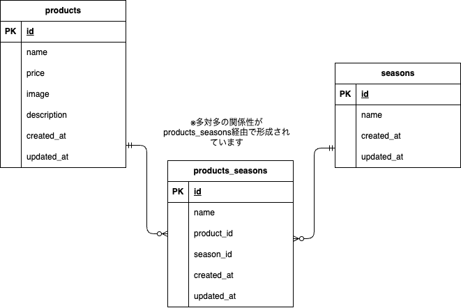

# もぎたて(商品情報管理アプリ)

果物を使ったスムージー商品管理アプリは、季節や価格、説明文を簡単に登録・更新できる便利なツールです。直感的に操作でき、商品情報をスマートに管理します。新鮮で美味しいスムージーを提供するための効率的な商品管理が実現します！

## 環境構築
**Dockerビルド**
1. `git clone git@github.com:S185900/mogitate-app.git`
2. DockerDesktopアプリを立ち上げる
3. `docker-compose up -d --build`

> *エラーになる場合はdocker-compose.ymlのバージョン名をコメントアウトか削除してください。*
``` docker-compose.yml
# version: '3.8'
```
> *MacのM1・M2チップのPCの場合、`no matching manifest for linux/arm64/v8 in the manifest list entries`のメッセージが表示されビルドができないことがあります。エラーが発生する場合は、docker-compose.ymlファイルの「mysql」内に「platform」の項目を追加で記載してください。(補足)もしくは、エラー後でも再度`docker-compose up -d --build`すると立ち上がる場合もあります。*
``` bash
mysql:
    platform: linux/x86_64(この文追加)
    image: mysql:8.0.26
    environment:
```

**Laravel環境構築**
1. `docker-compose exec php bash`
2. `composer install`
3. 「.env.example」ファイルを 「.env」ファイルに命名を変更。または、新しく.envファイルを作成
4. .envに以下の環境変数を追加
``` text
DB_CONNECTION=mysql
DB_HOST=mysql
DB_PORT=3306
DB_DATABASE=laravel_db
DB_USERNAME=laravel_user
DB_PASSWORD=laravel_pass
```
5. アプリケーションキーの作成と設定のキャッシュクリア
``` bash
php artisan key:generate
php artisan config:clear

// env.ファイルとアプリケーションキーを変更した場合は、エラー回避のため必ず設定のキャッシュクリアを行ってください。
```
6. シンボリックリンクの作成
> *ファイルアップロード時にstorage/app/publicに保存されるファイルを、public/storageからアクセスできるようにしておきます*
``` bash
php artisan storage:link

// 既存のリンクがある場合は削除してから再作成してください
rm -rf public/storage
php artisan storage:link

// 以下コードでシンボリックリンクの状態を確認できます
ls -l public/storage
```

7. マイグレーションの実行
``` bash
php artisan migrate
```

8. シーディングの実行
``` bash
php artisan db:seed
```

## 使用技術(実行環境)
- PHP 7.4.9
- Laravel 8.83.8
- MySQL 8.0.26
- Composer 2.8.9

## ER図


## URL
- 開発環境：http://localhost/
- phpMyAdmin:：http://localhost:8080/

## テーブル仕様

#### productsテーブル
| カラム名 | 型 | PRIMARY KEY | NOT NULL | 補足 |
| --- | --- | --- | --- | --- |
| id | bigint unsigned | ◯ |  |  |
| name | varchar(255) |  | ◯ | 商品名 |
| price | int |  | ◯ | 商品料金 |
| image | varchar(255) |  | ◯ | 商品画像 |
| description | text |  | ◯ | 商品説明 |
| created_at | timestamp |  |  |  |
| updated_at | timestamp |  |  |  |

#### seasonsテーブル
| カラム名 | 型 | PRIMARY KEY | NOT NULL | 補足 |
| --- | --- | --- | --- | --- |
| id | bigint unsigned | ◯ |  |  |
| name | varchar(255) |  | ◯ | 季節名 |
| created_at | timestamp |  |  |  |
| updated_at | timestamp |  |  |  |

#### product_seasonテーブル(中間テーブル)
| カラム名 | 型 | PRIMARY KEY | NOT NULL | FOREIGN KEY |
| --- | --- | --- | --- | --- |
| id | bigint unsigned | ◯ |  |  |
| product_id | bigint unsigned |  | ◯ | products(id) |
| season_id | bigint unsigned |  | ◯ | seasons(id) |
| created_at | timestamp |  |  |  |
| updated_at | timestamp |  |  |  |


## ルーティング情報
| 商品一覧 | /products |
| --- | --- |
| 商品詳細 | /products/{productId} |
| 商品更新 | /products/{productId}/update |
| 商品登録 | /products/register |
| 検索 | /products/search |
| 削除 | /products/{productId}/delete |

## tree図
